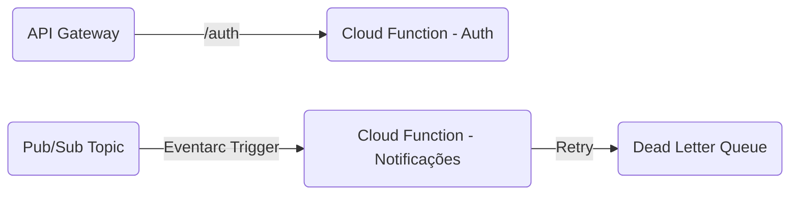

# Oficina Mecânica - Componentes Serverless

## Propósito
Abriga as Cloud Functions responsáveis por domínios desacoplados e de execução assíncrona, desonerando a API principal. Inclui a emissão/validação de Tokens JWT (Autenticação) e o consumidor do Eventarc para disparo de e-mails (Notificações de OS).

## Tecnologias Utilizadas
- **Python 3.12** com **Functions Framework**
- **Terraform** (Infraestrutura as Code)
- **Google Cloud Functions v2** (Cloud Run)
- **Eventarc** & **Pub/Sub**
- **API Gateway**

## Passos para Execução e Deploy

**Execução Local:**
1. Instale o `functions-framework`.
2. Rode o consumidor localmente: `functions-framework --target=notificacoes_handler --signature-type=cloudevent`

**Deploy:**
Realizado nativamente via Terraform no Github Actions. Qualquer merge nas branches rastreadas atualiza as funções através da diretiva `google_cloudfunctions2_function` que compacta e envia a pasta `src/` ao Google Cloud Storage.

## Diagrama de Arquitetura

## APIs e Documentação
- A autenticação é exposta externamente via API Gateway. 
- O contrato dos end-points serverless encontra-se consolidado no **Swagger** central da `oficina-api`, não havendo página OpenAPI dedicada exclusivamente às functions assíncronas.

