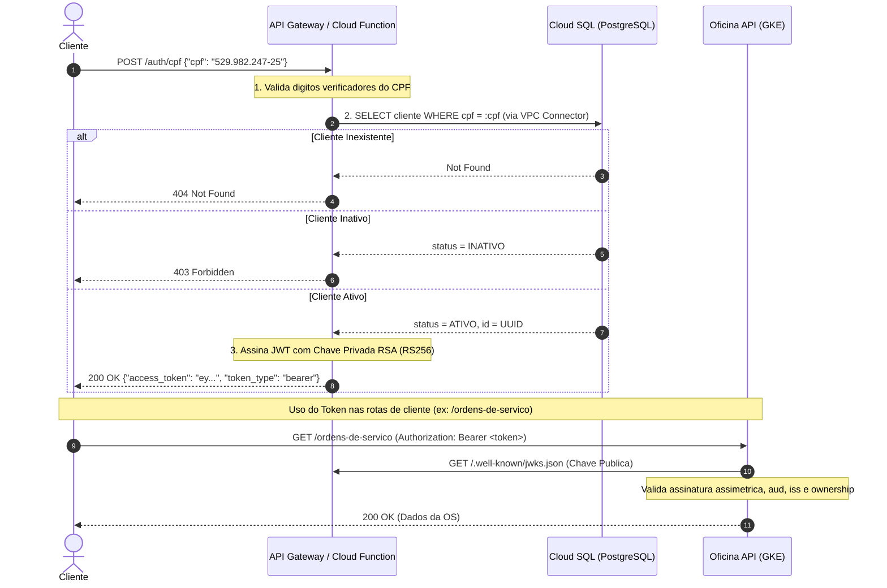

# Arquitetura: Autenticação por CPF e JWKS (Serverless)

## 1. Visão Geral
A autenticação do ator **CLIENTE** foi desacoplada do monolito e implementada como uma **Cloud Function serverless**, garantindo escalabilidade, segurança e isolamento de responsabilidades.

## 2. Padrões de Segurança
- **Assinatura Assimétrica (RS256)**: Apenas a Cloud Function possui a chave privada RSA. Qualquer serviço (como a API ou o API Gateway) valida os tokens usando exclusivamente a chave pública distribuída via JWKS.
- **Formato JWKS (RFC 7517)**: Exposto em `/.well-known/jwks.json` com `kty: RSA`, `use: sig`, `alg: RS256` e identificador de chave (`kid`).
- **Comunicação Privada com o Banco**: A Cloud Function utiliza o **Serverless VPC Access connector** para alcançar o Cloud SQL exclusivamente através da rede VPC por IP privado (`10.0.0.0/20`), sem expor o banco à internet pública.
